<p align="center">
  
</p>

<p align="center">
  <picture>
    <source media="(prefers-color-scheme: dark)" srcset="https://readme-typing-svg.demolab.com?font=Fira+Code&weight=600&size=20&duration=2600&pause=800&color=FFFFFF&center=true&vCenter=true&width=700&lines=%24+AI%2FML+Security+%26+LLM+Red+Teaming;%24+Cloud+Security+Architecture;%24+DevSecOps+%26+Pipeline+Security;%24+Penetration+Testing+%26+Purple+Teaming;%24+Security+Engineering+%26+Automation;%24+Incident+Response+%26+SOC+Leadership;%24+Threat+Modeling+%28MITRE+ATT%26CK+%2F+ATLAS%29;%24+GRC+%26+Compliance;%24+Vulnerability+Management;%24+Security+Analytics+%26+Detection+Engineering;%24+Application+Security+%28DAST+%2F+SAST%29;%24+ICS+%2F+OT+%2F+IoT+%2F+SCADA+%2F+Mobile+Security;%24+securing+LLMs+%26+agentic+AI+systems;%24+hardening+AWS+%2F+GCP+cloud+platforms;%24+shifting+security+left+with+DevSecOps;%24+automating+recon+%26+attack+surface+mapping;%24+reversing+malware+%26+phishing+kits"/>
    <source media="(prefers-color-scheme: light)" srcset="https://readme-typing-svg.demolab.com?font=Fira+Code&weight=600&size=20&duration=2600&pause=800&color=000000&center=true&vCenter=true&width=700&lines=%24+AI%2FML+Security+%26+LLM+Red+Teaming;%24+Cloud+Security+Architecture;%24+DevSecOps+%26+Pipeline+Security;%24+Penetration+Testing+%26+Purple+Teaming;%24+Security+Engineering+%26+Automation;%24+Incident+Response+%26+SOC+Leadership;%24+Threat+Modeling+%28MITRE+ATT%26CK+%2F+ATLAS%29;%24+GRC+%26+Compliance;%24+Vulnerability+Management;%24+Security+Analytics+%26+Detection+Engineering;%24+Application+Security+%28DAST+%2F+SAST%29;%24+ICS+%2F+OT+%2F+IoT+%2F+SCADA+%2F+Mobile+Security;%24+securing+LLMs+%26+agentic+AI+systems;%24+hardening+AWS+%2F+GCP+cloud+platforms;%24+shifting+security+left+with+DevSecOps;%24+automating+recon+%26+attack+surface+mapping;%24+reversing+malware+%26+phishing+kits"/>
    
  </picture>
</p>

<p align="center">
  <a href="https://www.linkedin.com/in/mohanareti/"></a>
  <a href="https://www.instagram.com/cyber.ai.with.mohan"></a>
  <a href="https://moharat.gitbook.io/cylabs"></a>
  <a href="https://x.com/mohareti"></a>
</p>

---

### `> cat about.md`

I'm a **Senior Manager of Technology at Publicis Sapient** with **~15 years** securing systems across **aviation, financial services, healthcare, and critical infrastructure**. I work where **cybersecurity meets AI**: securing cloud platforms and AI systems, and using AI to build sharper security tooling.

```yaml
focus:
  ai_security:    [LLM & agent threat modeling, adversarial ML, MCP security, OWASP LLM Top 10, MITRE ATLAS]
  cloud_security: [AWS, GCP, security architecture, PCI DSS, certificate lifecycle management]
  devsecops:      [secure CI/CD, Kubernetes, Helm, Terraform, GitOps]
  purple_team:    [adversary emulation, detection engineering, threat hunting, attack surface management, pentesting, malware & APK reversing]
education:
  - M.S. Computer Network Security — KL University
  - M.S. Computational Science — Texas A&M–Commerce (IoT security research, SDPS Lab)
```

---

### `> ls ./featured`

| Project | What it does | Stack |
|---|---|---|
| [**AI_Security**](https://github.com/mohareti/AI_Security) | Practitioner notes & methodology for AI/LLM security assessments | OWASP LLM Top 10 · MITRE ATLAS |
| [**E_Challan_Fake_APK_Analysis**](https://github.com/mohareti/E_Challan_Fake_APK_Analysis) | Reverse engineering of Android malware used in fake traffic-fine scams | Smali · JADX |
| [**Suspicious_APK_Analysis**](https://github.com/mohareti/Suspicious_APK_Analyis) | Static analysis tooling for suspicious Android packages | Python |
| [**Darcula_PK**](https://github.com/mohareti/Darcula_PK) | Deobfuscation & analysis of a phishing-kit JavaScript payload | JavaScript |
| [**wazuh-aks-poc**](https://github.com/mohareti/wazuh-aks-poc) | Wazuh SIEM/XDR on Kubernetes (AKS) via Helm | Kubernetes · Helm · Wazuh |
| [**Threat_Hunt_KQL_Queries**](https://github.com/mohareti/Threat_Hunt_KQL_Queries) | Threat-hunting queries for Microsoft Defender | KQL |

---

### `> which --all tools`

<p align="center">
  
</p>
<p align="center">
  
  
  
  
  
  
  
</p>

---

### `> ps aux | grep current`

- 🛰️ Building AI-driven attack surface & recon tooling on Kubernetes
- 🤖 Researching **MCP server & agentic-AI security**
- 📢 Writing the **#AISEC** series on Instagram to make AI security approachable
- 🟣 Running purple-team exercises, playing CTFs & attending DEF CON

---

### `> ./contributions --watch`

<p align="center">
  <picture>
    <source media="(prefers-color-scheme: dark)" srcset="https://raw.githubusercontent.com/mohareti/mohareti/output/snake-dark.svg"/>
    <source media="(prefers-color-scheme: light)" srcset="https://raw.githubusercontent.com/mohareti/mohareti/output/snake-light.svg"/>
    
  </picture>
</p>

<p align="center">
  
</p>
